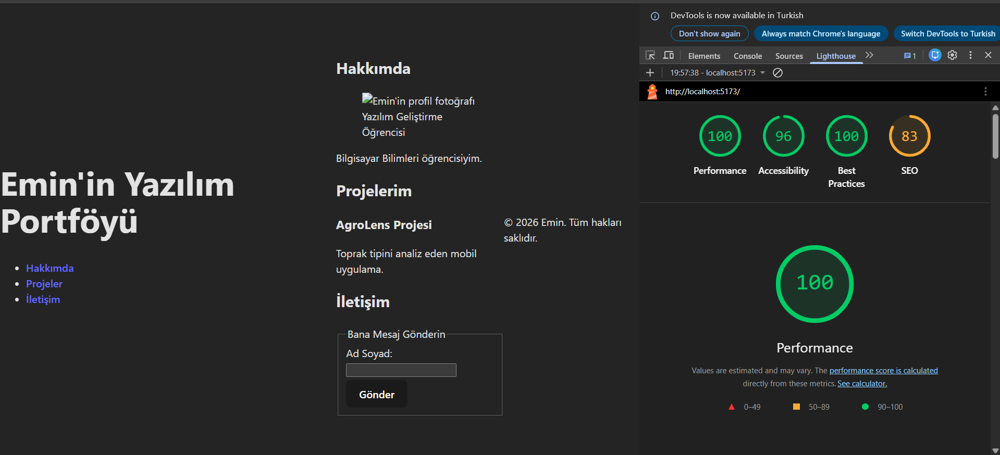

# Emin'in Portfolyosu - Web Tasarımı ve Programlama LAB-3 & LAB-4

Bu proje, Web Tasarımı ve Programlama dersi kapsamında geliştirilen kişisel bir portfolyo web sitesidir. **LAB-3** ile birlikte proje tamamen responsive (duyarlı) ve modern bir tasarıma kavuşturulmuştur.

## 🚀 Beklenti ve Geliştirmeler (LAB-3)

LAB-3 dökümanındaki gereksinimler doğrultusunda projeye aşağıdaki modern CSS mimarileri ve teknikleri entegre edilmiştir:

### 1. CSS Design Tokens ve Tema Yapısı (`tokens.css`)
- Sitenin renk paleti, boşluk (spacing) birimleri, köşe yuvarlatmaları (border-radius) ve gölge (shadow) ayarları `:root` içerisinde CSS değişkenleri (custom properties) olarak tanımlandı.
- Modern ve şık bir görünüm elde etmek için `Zinc/Slate` koyu tonları ile `Elegant Violet` ve `Sky Blue` gibi canlı vurgu renkleri kullanıldı.

### 2. Akıcı Tipografi (Fluid Typography)
- Font boyutları sabit piksel (px) değerleri yerine `clamp()` fonksiyonu ile dinamik hale getirildi. Bu sayede ekran genişliğine bağlı olarak metinler orantılı bir şekilde büyüyüp küçülmektedir.

### 3. Esnek Kutu ve Izgara Yerleşimi (Flexbox & Grid)
- **Flexbox:** `header` içeriği, navigasyon menüsü (`nav ul`), Hakkımda bölümü düzeni ve yetenek etiketleri (`.skill-tags`) için esnek tek boyutlu (1D) yerleşim sistemi olan Flexbox kullanıldı.
- **CSS Grid:** "Projelerim" sekmesindeki kartların yerleşimi için iki boyutlu (2D) Grid kullanıldı. `repeat(auto-fit, minmax(320px, 1fr))` yapısı sayesinde ekran genişliği ne olursa olsun satır ve sütunlar kusursuz bir şekilde yeniden dizilmektedir.

### 4. Mobile-First (Önce Mobil) Yaklaşımı
Projenin medya sorguları (Media Queries) önce mobil görünüm esas alınarak yazıldı:
- **Varsayılan Görünüm (0-639px):** Bütün içerik tek sütun halinde listelenir.
- **Tablet (640px+):** `Hakkımda` kısmı ve form elemanları yan yana (yatay) akmaya başlar.
- **Masaüstü (1024px+):** İçerik maksimum `1280px` ile sınırlanır ve Grid sistemindeki projeler en az 3 sütun olarak yatay düzende sergilenir.

### 5. Güncel GitHub Entegrasyonu
- "Projelerim" kısmına güncel, gerçek GitHub projelerim (Expense Tracker, Film Recommender vb.) dâhil edildi. Projeler kart mimarisi ve *glassmorphism* hover (üzerine gelme) efektleri ile modern bir şekilde stilize edildi.

---

## 📷 Ekran Görüntüleri ve Performans
Projenize ait tüm görsellere `screenshots/` klasöründen veya her laboratuvar için hazırlanan `walkthrough.md` belgelerinden ulaşabilirsiniz.

---

## 🔥 Modern Bileşen Mimarisi (LAB-4)

LAB-4 kapsamında proje **Utility-First CSS** yaklaşımıyla Tailwind CSS v4'e taşınmış ve modüler bir yapıya kavuşturulmuştur.

### 1. Tailwind CSS v4 ve Dinamik Tema
- Proje altyapısı `@tailwindcss/vite` ile modernize edildi.
- `index.css` içerisinde tanımlanan CSS değişkenleri ve Tailwind'in yeni `@theme` blokları sayesinde **Karanlık Tema (Dark Mode)** desteği tam kararlı hale getirildi.

### 2. Yeniden Kullanılabilir Bileşenler (Components)
- **Button, Input, Card, Alert** gibi temel UI bileşenleri geliştirildi.
- Her bileşen; `primary`, `secondary`, `success`, `error` gibi fonksiyonel varyantlara ve farklı boyut (sm, md, lg) özelliklerine sahiptir.

### 3. Portfolyo Modernizasyonu
- Tüm sayfa yapısı Tailwind sınıfları ile yeniden düzenlendi.
- Layout ve hizalama sorunları giderildi; Hakkımda ve Projelerim bölümleri tam ortalanmış, modern bir grid yapısına taşındı.

### 4. UI Kit Sayfası
- Geliştirilen tüm bileşenlerin canlı örneklerini ve kullanım şekillerini sergileyen kapsamlı bir `/uikit` sayfası projeye dahil edildi.

### LAB-2 Erişilebilirlik Raporu (Geçmiş)
Lighthouse denetimi sonucunda %96 erişilebilirlik puanı elde edilmiştir.

---
*Proje: React + TypeScript + Vite altyapısı üzerindedir.*
